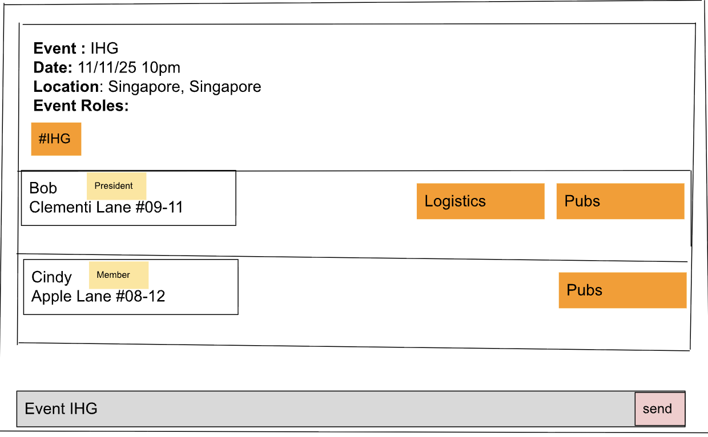

# EASync

**EASync** is a lightweight event and member management application designed for club managers. 
It provides a centralised system to organise people and events without the clutter of spreadsheets.

## Features

With EASync, you can:
  * Keep track of upcoming and past events in one place
  * Organise members, staff, volunteers, or participants across events
  * Assign and manage roles and responsibilities
  * Store and update contact information with ease

## Why EASync?

Optimised for users who prefer typing-first input over slow, point-and-click interfaces, EASync makes it simple to
stay organised, even as your club grows.

# Acknowledgements
This project is based on the AddressBook-Level3 project created by the [SE-EDU initiative](https://se-education.org).
