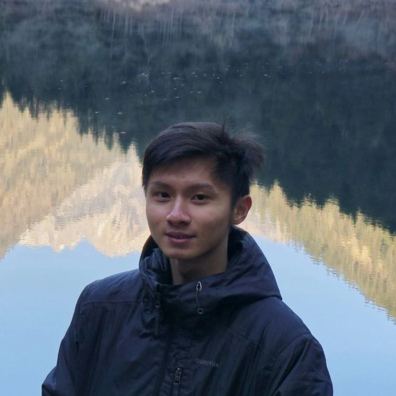

# About Us

We are a team based in the [School of Computing, National University of Singapore](http://www.comp.nus.edu.sg).

You can reach us at the email `seer[at]comp.nus.edu.sg`

## Project team

### Huang Kaijuan Joulene

[[homepage]()]
[[github](https://github.com/joulenergy)]
[[portfolio](team/johndoe.md)]

* Role: Team Lead
* Responsibilities: Code Quality

### Win Paing Oo

[[github](http://github.com/ferroklaser)]
[[portfolio](team/johndoe.md)]

* Role: Project Coordinator
* Responsibilities: Deliverables, Deadlines, Scheduling, Tracking

### Johnny Doe

[[github](http://github.com/johndoe)] [[portfolio](team/johndoe.md)]

* Role: Developer
* Responsibilities: Data

### Wong Rong Kang

[[github](http://github.com/rongkangw)]
[[portfolio](team/johndoe.md)]

* Role: Developer
* Responsibilities: Testing

### Wong Hong Xun

[[github](http://github.com/hongxun03)]
[[portfolio](team/johndoe.md)]

* Role: Developer, DevOps Engineer
* Responsibilities: Integration
