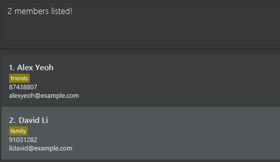

# EASync User Guide

EASync is a **desktop app that helps student club managers manage member contacts and club events quickly and easily.** Just type to add members, schedule events, or update roles — no need to click through menus. It’s fast, simple, and visual — so you can skip the cluttered spreadsheets and get things done.

<!-- * Table of Contents -->
<page-nav-print />

--------------------------------------------------------------------------------------------------------------------

## Quick start

1. Ensure you have Java `17` or above installed in your Computer. 
   **Mac users:** Ensure you have the precise JDK version prescribed [here](https://se-education.org/guides/tutorials/javaInstallationMac.html).

1. Download the latest `.jar` file from [here](https://github.com/AY2526S1-CS2103T-T11-3/tp/releases).

1. Copy the file to a folder you want to use as the _home folder_ for your ClubBook.

1. Open a command terminal, `cd` into the folder you put the jar file in, and use the `java -jar EASync.jar` command to run the application. 
   A GUI similar to the below should appear in a few seconds. Note how the app contains some sample data. 
   

1. Type the command in the command box and press Enter to execute it. e.g. typing **`help`** and pressing Enter will open the help window. 
   Some example commands you can try:

   * `listEvents` : Lists all events.

   * `addMember n/John Doe p/98765432 e/johnd@example.com` : Adds a member named `John Doe` to the Club Book.   Notice that the Club Book switches to the member list.

   * `deleteMember 3` : Deletes the 3rd member shown in the current list.

   * `addEvent n/Team Bonding f/15/10/2025 t/16/10/2025` : Adds an event named `Team Bonding` to the Club Book.   Notice that the Club Book switches to the event list.

   * `assignEvent e/Team Bonding m/John Doe r/Logistics` : Assigns `John Doe` to handle `Logistics` in the `Team Bonding` event

   * `clear` : Deletes all members and events.

   * `exit` : Exits the app.

1. Refer to the [Features](#features) below for details of each command.

--------------------------------------------------------------------------------------------------------------------

## Features

<box type="info" seamless>

**Notes about the command format:** 

* Words in `UPPER_CASE` are the parameters to be supplied by you. 
  e.g. in `addMember n/NAME`, `NAME` is a parameter which can be used as `add n/John Doe`.

* Items in square brackets are optional. 
  e.g. `n/NAME [r/ROLE]` can be used as `n/John Doe r/friend` or as `n/John Doe`.

* Items with `…`​ after them can be used multiple times including zero times. 
  e.g. `[t/TAG]…​` can be used as ` ` (i.e. 0 times), `t/friend`, `t/friend t/family` etc.
</box>

<box type="tip" seamless>

**Tips for command flexibility:** 

* Parameters can be in any order. 
  e.g. if the command specifies `n/NAME p/PHONE_NUMBER`, `p/PHONE_NUMBER n/NAME` is also acceptable.

* Extraneous parameters for commands that do not take in parameters (such as `help`, `list`, `exit` and `clear`) will be ignored. 
  e.g. if the command specifies `help 123`, it will be interpreted as `help`.
</box>

<box type="warning" seamless>

**Caution:**
If you are using a PDF version of this document, be careful when copying and pasting commands that span multiple lines as space characters surrounding line-breaks may be omitted when copied over to the application.
</box>

### Viewing help : `help`

Shows a message explaining how to access the help page.

Format: `help`

### Managing Members

#### Listing all members : `listMembers`

Format: `listMembers`

* Displays a list of all members in the club book.

#### Adding a member: `addMember`

Format: `addMember n/NAME p/PHONE e/EMAIL [r/ROLE]…​`

* Adds a member to the club book.
* The new member can be found at the end of the list.
* * If multiple `ROLE`s are specified, the app sorts them in lexographical order.

Examples:
* `addMember n/Alice Pauline p/94351253 e/alice@example.com r/friends`
* `addMember n/Benson Meier r/owesMoney e/benson@example.com p/98765432 r/friends`

#### Deleting a member : `deleteMember`

Format: `deleteMember INDEX`

* Deletes the member at the specified `INDEX`.
* `INDEX` refers to the index number shown in the displayed member list.
* `INDEX` **must be a positive integer** e.g. 1,2,3, …​

Examples:
* `listMembers` then `deleteMember 2` removes the 2nd member in the displayed member list.
* `find Andy` then `deleteMember 1` removes the 1st member in the **search result**.

<box type="important" seamless>
    
**Note:** You should run `listMembers` or `find` first, then look for the index of the member you want to delete. Otherwise, you might accidentally delete the wrong member.
</box>

#### Editing a member : `editMember`

Format: `editMember INDEX [n/NAME] [p/PHONE] [e/EMAIL] [r/ROLE]…​`

* Edits the details of the member at the specified `INDEX`.
* `INDEX` refers to the index number shown in the displayed member list. 
* `INDEX` **must be a positive integer** e.g. 1, 2, 3, …​
* At least one of the optional fields must be provided.
* Existing values for the provided field will be updated to the input values.
* Fields not provided will remain **unchanged**.

<box type="tip" seamless>

**Tip:** You can remove all the member’s roles by typing `r/` without specifying any roles after it.
</box>

<box type="warning" seamless>

**Caution:** When editing roles, the existing roles of the member will be removed i.e. adding of roles is not cumulative.
</box>

Examples:
*  `editMember 1 p/91234567 e/johndoe@example.com` Edits the phone number and email address of the 1st member to be `91234567` and `johndoe@example.com` respectively.
*  `editMember 2 n/Betsy Crower r/` Edits the name of the 2nd member to be `Betsy Crower` and clears all existing roles.

#### Locating members by name: `find`

Format: `find KEYWORD [MORE_KEYWORDS]`

* Finds members whose names contain any of the given keywords.
* Only the name is searched.
* The search is case-insensitive. e.g. `hans` will match `Hans`
* The order of the keywords does not matter. e.g. `Hans Bo` will match `Bo Hans`
* Members matching at least one keyword will be returned (i.e. `OR` search).
  e.g. `Hans Bo` will return `Hans Gruber`, `Bo Yang`

<box type="important" seamless>

**Note:** Only full words will be matched e.g. `Han` will not match `Hans`
</box>

Examples:
* `find John` returns `john` and `John Doe`
* `find alex david` returns `Alex Yeoh`, `David Li` 
  

### Managing Events

#### Listing all events : `listEvents`

Format: `listEvents`

* Displays a list of all events in the club book.

#### Adding an event: `addEvent`

Format: `addEvent n/NAME f/DATE_TIME [t/DATE_TIME] [d/DETAILS] [r/EVENTROLE]…​`

* Adds an event to the club book.
* The new event can be found at the end of the list.
* If multiple `EVENTROLE`s are specified, the app sorts them in lexographical order.

Examples:
* `addEvent n/Orientation f/15/10/2025 d/For freshmen r/facilitator r/gamemaster`
* `addEvent n/Movie Night r/FoodIC f/20/10/2025 1800 t/20/10/2025 2000`

#### Deleting an event : `deleteEvent`

Format: `deleteEvent INDEX`

* Deletes the event at the specified `INDEX`.
* `INDEX` refers to the index number shown in the displayed event list.
* `INDEX` **must be a positive integer** e.g. 1,2,3, ...​

Examples:
* `listEvents` then `deleteEvent 2` removes the 2nd event in the displayed event list.

<box type="important" seamless>

**Note:** You should run `listEvents` first, then look for the index of the event you want to delete. Otherwise, you might accidentally delete the wrong event.
</box>

#### Displaying an event : `event`

Format: `event INDEX`

*  Displays the event at the specified `INDEX`.
* `INDEX` refers to the index number shown in the displayed event list.
* `INDEX` **must be a positive integer 1,2,3, ...​**

Examples:
* `listEvents` then `event 2` displays the full content of the 2nd event in the displayed event list.

### Managing Event Participants

<box type="info" seamless>

**Note:** 
* Unlike previous commands, you should specify the names for `e/EVENT` and `m/MEMBER` instead of their indices for the following set of commands.
</box>

#### Assigning a Member to an Event : `assignEvent`

Format: `assignEvent e/EVENT m/MEMBER [r/EVENTROLE]…​`

* Assigns the specified member with an event role for the specified event.
* Multiple event roles can be specified.
* If `EVENTROLE` is not specified, they are just a participant.

Examples:
* `assignEvent e/Orientation m/Alice Pauline`
* `assignEvent e/Movie Night m/Benson Meier r/FoodIC`

#### Unassigning a Member from an Event : `unassignEvent`

Format: `unassignEvent e/EVENT m/MEMBER [r/EVENTROLE]…​`

* Removes an event role from the specified member.
* Multiple event roles can be specified.
* If `EVENTROLE` is not specified, the member is unassigned from the event and all associated event roles are removed, if any.

Examples:
*  `unassignEvent e/Meeting m/Bob r/Logistics`
*  `unassignEvent e/Workshop m/Jane`

### Miscellaneous
#### Clearing all entries : `clear`

<box type="warning" theme="danger" seamless>

**Caution:**
This action is **irreversible**! Ensure that you truly want to clear your **entire club book** before proceeding.
</box>

Format: `clear`

* Clears **all members and events** from the club book.

#### Exiting the program : `exit`

Format: `exit`

* Exits the program.

### Saving the data

ClubBook data are saved in the hard disk automatically after any command that changes the data. There is no need to save manually.

### Editing the data file

Member and Event data are saved automatically as a JSON file in `[JAR file location]/data/members.json` and `[JAR file location]/data/events.json` respectively.

Advanced users are welcome to update data directly by editing that data file.

<box type="warning" seamless>

**Caution:**
If your changes to the data file makes its format invalid, ClubBook will discard all data and start with an empty data file at the next run.  Hence, it is recommended to take a backup of the file before editing it. 
Furthermore, certain edits can cause the ClubBook to behave in unexpected ways (e.g., if a value entered is outside the acceptable range). Therefore, edit the data file only if you are confident that you can update it correctly.
</box>

--------------------------------------------------------------------------------------------------------------------

## FAQ
**Q**: I deleted a member/event by mistake, can I undo it?  
**A**: There’s no undo feature yet, and changes save immediately. If you have a backup of members.json or events.json, restore it to recover. Otherwise, re-add the item manually. An undo command is planned for a future release, and this guide will be updated when it’s available.

**Q**: Can I delete several members/events at once?  
**A**: There’s no bulk delete feature yet. You can remove multiple items by running deleteMember or deleteEvent repeatedly. A bulk delete option is planned for a future release, and this guide will be updated when it’s available.

**Q**: How do I transfer my data to another Computer? 
**A**: Follow these steps:
  1. Make a copy of the `data` folder in the **home folder of your current installation**.  
  2. Install EASync on another computer (follow the [Quick Start guide](#quick-start))
  3. Take the copied `data` folder and overwrite the `data` folder in the **home folder of your new installation**
  4. Run EASync on the new computer and verify that your data has been transferred successfully.

--------------------------------------------------------------------------------------------------------------------

## Known issues

1. **When using multiple screens**, if you move the application to a secondary screen, and later switch to using only the primary screen, the GUI will open off-screen. The remedy is to delete the `preferences.json` file created by the application before running the application again.
2. **If you minimize the Help Window** and then run the `help` command (or use the `Help` menu, or the keyboard shortcut `F1`) again, the original Help Window will remain minimized, and no new Help Window will appear. The remedy is to manually restore the minimized Help Window.

--------------------------------------------------------------------------------------------------------------------

## Command summary

| Action             | Format, Examples                                                                                                |
|--------------------|-----------------------------------------------------------------------------------------------------------------|
| **List Members**   | `listMembers`                                                                                                   |
| **Add Member**     | `addMember n/NAME p/PHONE e/EMAIL [r/ROLE]…​`                                                                   |
| **Delete Member**  | `deleteMember INDEX`  e.g., `deleteMember 3`                                                                 |
| **Edit Members**   | `edit INDEX [n/NAME] [p/PHONE_NUMBER] [e/EMAIL] [t/TAG]…​`  e.g.,`edit 2 n/James Lee e/jameslee@example.com` |
| **Find Members**   | `find KEYWORD [MORE_KEYWORDS]`  e.g., `find James Jake`                                                      |
| **List Events**    | `listEvents`                                                                                                    |
| **Add Event**      | `addEvent n/NAME f/DATE_TIME [t/DATE_TIME] [d/DETAILS] [r/EVENTROLE]…​`                                         |
| **Delete Event**   | `deleteEvent INDEX`   e.g., `deleteEvent 3`                                                                  |
| **Assign Event**   | `assignEvent e/EVENT m/MEMBER [r/EVENTROLE]…​`                                                                  |
| **Unassign Event** | `unassignEvent e/EVENT m/MEMBER [r/EVENTROLE]…​`                                                                |
| **Clear**          | `clear`                                                                                                         |
| **Help**           | `help`                                                                                                          |
| **Exit**           | `exit`                                                                                                          |
