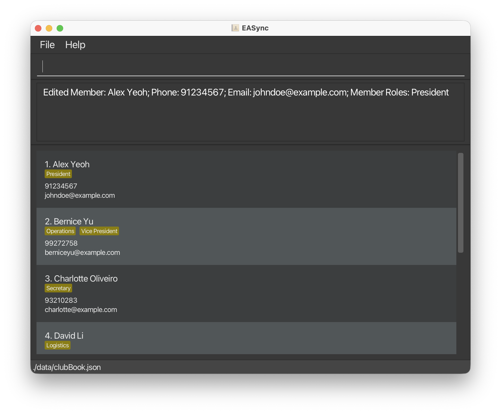
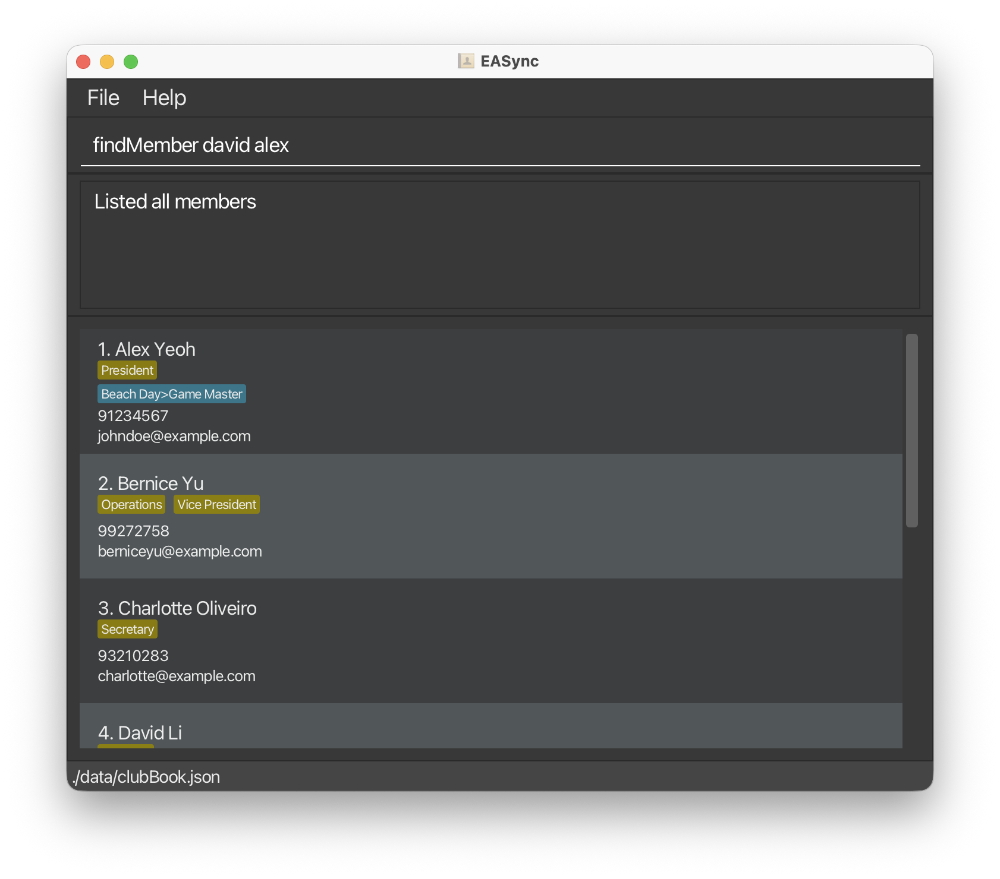

# EASync User Guide

EASync is a desktop app designed to help student club managers stay organized with ease. Whether you are coordinating events, tracking member roles, or updating contact lists, EASync makes it easy to manage everything from one club book.

You do not need to be a programmer or technical expert. Using EASync is like sending a text: simple, fast, and intuitive. It’s designed to be visual and beginner-friendly, so you can focus on running your club, not figuring out complicated software or clicking through menus.

<!-- * Table of Contents -->
<page-nav-print />

--------------------------------------------------------------------------------------------------------------------

## Quick start

1. **Set up Java**  
   To run EASync, your computer needs to have Java version 17 or higher installed. Using the step-by-step guides [here](https://se-education.org/guides/tutorials/javaInstallation.html), you can:
    * Check if Java is already installed on your computer.
    * Install the correct version if needed.
    * Verify your installation afterward.

2. **Download EASync**  
   Go to [our releases page on GitHub](https://github.com/AY2526S1-CS2103T-T11-3/tp/releases) to download the latest `EASync.jar` file.

3. **Choose a Folder for EASync**  
    * Create or pick a folder where you would like to keep your EASync files.
    * Then, move the `EASync.jar` file you just downloaded into that folder.  
      📁 Example: You could create a folder on your Desktop called `EASync`.

4. **Run EASync**  
  Open a command terminal and navigate to the folder where you placed the JAR file, then use the `java -jar EASync.jar` command to run the application.
    * You can navigate between folders using the `cd path/to/your/folder` command in the terminal. For example, `cd C:/Users/<your username>/Desktop/EASync`.
    * After a few seconds, EASync will open, and you should see a window like this: 

<box type="info">

EASync starts with some sample data so you can explore its features right away!
</box>

5. **Try out some commands**  
   You can control EASync by typing into the `Enter command here...` command box and pressing *Enter*.  
   For example: Type `help` and press *Enter* — this opens the Help window. 

   💡 Commands for getting started:

    * `listEvents` : Shows all the events currently in your club book.

    * `addMember n/John Doe p/98765432 e/johnd@example.com` : Adds a member named `John Doe` to the club book.   Notice that EASync switches to display the member list.

    * `deleteMember 3` : Deletes the 3rd member shown in the current member list.

    * `addEvent n/Team Bonding f/151025 1300 t/161025 1500 r/Logistics` : Adds an event named `Team Bonding` to the club book.   Notice that EASync switches to display the event list.

    * `assignEvent e/Team Bonding m/John Doe r/Logistics` : Assigns `John Doe` to handle `Logistics` in the `Team Bonding` event.   Notice that EASync switches to display the details of the single event Team Bonding.

    * `clear` : Delete all members and events from the club book to create your own. Note that this is irreversible!

    * `exit` : Closes the window and exits the program.

6. Refer to the [Features](#features) below for details of each command.

--------------------------------------------------------------------------------------------------------------------

## Features

<box type="info">

**Notes about the command format:**  

* **Words in `UPPER_CASE` are the parameters that you type in.** 
  e.g. in `addMember n/NAME`, `NAME` is a parameter which can be used as `addMember n/John Doe`.

* **Parameters can be in any order.** 
  e.g. if the command specifies `n/NAME p/PHONE`, `p/PHONE n/NAME` is also acceptable.

* **Any extra parameters for commands that do not take in parameters (such as `help`, `list`, `exit` and `clear`) will be ignored.** 
  e.g. if the command specifies `help 123`, it will be interpreted as `help`.

* **Items in square brackets are optional**.  
  e.g. `n/NAME [r/MEMBER_ROLE]` can be used as `n/John Doe r/Logistics` or as `n/John Doe`.

* **Items with `…`​ after them can be used multiple times, or omitted completely.** 
  e.g. `[r/MEMBER_ROLE]…​` can be `r/Logistics`, `t/Publicity t/Logistics` or not be used at all.

</box>

<box type="info">

**Notes about parameters:**  

* **The forward slash `/` is reserved for command parameters and cannot be used in any input field.** 
  e.g. `n/Alice\Bob` will result in the name being saved as `Alice/Bob`.
  <box type="tip">

  For **`NAME`** and **`DETAILS`** fields, you may type a backslash (`\`) instead if you still wish to include a forward slash.
  EASync will automatically convert it to a forward slash after the command runs. 
  </box>

* **For `NAME`, `MEMBER_ROLE` and `EVENT_ROLE` parameters, multiple spaces will be treated as single space.** 
  e.g. `n/John    Doe` will be treated as `n/John Doe`.
</box>

<box type="warning">

**Handling duplicates:**  

* All names (such as member names, event names, and event role names etc.) are considered duplicates if they have the **same spelling and spacing, ignoring letter case.** 
  e.g. `John Doe` and `john doe` are the same, but `John Doe` and `JohnDoe` are different.
  </box>

### Viewing help : `help`

Format: `help`

Shows a message explaining how to access the help page.

### Managing Members

#### Listing all members: `listMembers`

Format: `listMembers`

* Displays a list of all members in the club book.

#### Adding a member: `addMember`

Format: `addMember n/NAME p/PHONE e/EMAIL [r/MEMBER_ROLE]…​`

* `PHONE` should be within 7–12 digits. You can add a country code in front by typing `+` followed by 1–3 digits (see [detailed requirements](#phone))
* `EMAIL` should be of the format `local-part@domain` (see [detailed requirements](#email))
* If multiple `MEMBER_ROLE` are specified, the app displays them in alphabetical order.
* Each `MEMBER_ROLE` should be 30 characters or fewer.
* The new member will be added to the end of the list.

Examples:
* `addMember n/Alice Pauline p/94351253 e/alice@example.com r/member`
* `addMember n/Benson Meier r/treasurer e/benson@example.com p/98765432 r/Publicity`

#### Deleting a member: `deleteMember`

Format: `deleteMember INDEX`

* Deletes the member at the specified `INDEX`.
* `INDEX` refers to the index number shown in the displayed member list.

Examples:
* `listMembers` then `deleteMember 2` removes the 2nd member in the displayed member list.
* `findMember Andy` then `deleteMember 1` removes the 1st member in the **search result** for members containing the keyword `Andy`.

#### Editing a member: `editMember`

Format: `editMember INDEX [n/NAME] [p/PHONE] [e/EMAIL] [r/MEMBER_ROLE]…​`

* Edits the details of the member at the specified `INDEX`.
* `INDEX` refers to the index number shown in the displayed member list.
* **At least one of the optional fields must be provided.**
* Existing values for the provided field will be updated to the input values.
* Fields not provided will remain **unchanged**.

Examples:
*  `editMember 1 p/91234567 e/johndoe@example.com` edits the phone number and email address of the 1st member to be `91234567` and `johndoe@example.com` respectively.
*  `editMember 2 n/Betsy Crower r/` edits the name of the 2nd member to be `Betsy Crower` and clears all existing roles.

<box type="tip">

**Tip:** You can remove all member roles by typing `r/` without specifying any roles after it.
</box>

<box type="warning">

**Caution:** When editing member roles, the existing roles of the member will be removed i.e. adding new member roles is not cumulative.
</box>

#### Locating members by name: `findMember`

Format: `findMember KEYWORD [MORE_KEYWORDS]`

* Finds members whose names contain any of the given keywords.
* Searching is case-insensitive. e.g. `hans` will match `Hans`
* The order of the keywords does not matter. e.g. `Hans Bo` will match `Bo Hans`
* Members matching at least one keyword will be returned (i.e. `OR` search).
  e.g. `Hans Bo` will return `Hans Gruber`, `Bo Yang`

Examples:
* `findMember John` returns `john` and `John Doe`
* `findMember alex david` returns `Alex Yeoh`, `David Li` 

<box type="warning">

**Caution:** Only full words will be matched, e.g. `Han` will not match `Hans`.
</box>

### Managing Events

#### Listing all events: `listEvents`

Format: `listEvents`

* Displays a list of all events in the club book.

#### Adding an event: `addEvent`

Format: `addEvent n/NAME f/DATE_TIME t/DATE_TIME [d/DETAILS] [r/EVENT_ROLE]…​`

* `f/` (from) represents the start date time and `t/` (to) the end date time of the event.
* `DATE_TIME` must be in the following format: `DDMMYY HHMM` (24 hour)
* `DETAILS` should be 500 characters or fewer.
* If multiple `EVENT_ROLE` are specified, the app displays them in alphabetical order.
* `EVENT_ROLE` should be 30 characters or fewer.
* The new event will be added to the end of the list.

Examples:
* `addEvent n/Orientation f/151025 1200 t/171025 1800 d/For freshmen r/facilitator r/gamemaster`
* `addEvent n/Movie Night r/FoodIC f/051025 1800 t/051025 2000`

#### Deleting an event: `deleteEvent`

Format: `deleteEvent INDEX`

* Deletes the event at the specified `INDEX`.
* `INDEX` refers to the index number shown in the displayed event list.

Examples:
* `listEvents` then `deleteEvent 2` removes the 2nd event in the displayed event list.

#### Editing an event: `editEvent`

Format: `editEvent INDEX [n/NAME] [f/DATE_TIME] [t/DATE_TIME] [d/DETAILS]`

* Edits the details of the event at the specified `INDEX`.
* `INDEX` refers to the index number shown in the displayed event list.
* **At least one of the optional fields must be provided.**
* Existing values for the provided field will be updated to the input values.
* Fields not provided will remain **unchanged**.

Examples:
*  `editEvent 1 n/Movie Night t/171025 1800` edits the name and end date time of the 1st event to be `Movie Night` and `171025 1800` respectively.

<box type="warning">

**Caution:** Event roles cannot be changed once the event is created (see [planned enhancements](DeveloperGuide.md#appendix-planned-enhancements)).
If you would like to update the list of roles (e.g. add new or rename existing ones), you need to delete the event and create it again using `addEvent` with the updated roles.
</box>

#### Locating events by name: `findEvent`

Format: `findEvent KEYWORD [MORE_KEYWORDS]`

* Finds events whose names contain any of the given keywords.
* Searching is case-insensitive. e.g. `orientation` will match `Orientation`
* The order of the keywords does not matter. e.g. `Orientation Day` will match `Day Orientation`
* Events matching at least one keyword will be returned (i.e. `OR` search).
  e.g. `Orientation Day` will return `Orientation`, `Beach Day`

Examples:
* `findEvent workshop` returns `Coding Workshop` and `Writing workshop`
* `findEvent day camp` returns `Beach Day`, `Scout camp`

<box type="warning">

**Caution:** Only full words will be matched, e.g. `Day` will not match `Days`
</box>

#### Displaying an event: `event`

Format: `event INDEX`

*  Displays the event at the specified `INDEX`.
* `INDEX` refers to the index number shown in the displayed event list.

Examples:
* `listEvents` then `event 2` displays the full content of the 2nd event in the displayed event list.

### Managing Event Participants

<box type="important">

**Note:** Unlike previous commands, you should specify the names for `e/EVENT` and `m/MEMBER` instead of their indices for the following set of commands.
</box>

#### Assigning a Member to an Event: `assignEvent`

Format: `assignEvent e/EVENT m/MEMBER [r/EVENT_ROLE]…​`

* Assigns the specified member with an event role for the specified event.
* Multiple event roles can be specified.
* If `EVENT_ROLE` is not specified, they are just a participant.

Examples:
* `assignEvent e/Orientation m/Alice Pauline`
* `assignEvent e/Movie Night m/Benson Meier r/FoodIC`

<box type="warning">

**Caution:** **Once a member has been assigned to an event, their roles for that event cannot be edited directly.**
To update an assigned member's event roles:
1. Unassign them from the event (using `unassignEvent`).
2. Reassign them with the updated roles (using `assignEvent`). 

Do note that this restriction applies only to event roles within the same event. Member roles and event roles in other events remain unaffected.
</box>

#### Unassigning a Member from an Event: `unassignEvent`

Format: `unassignEvent e/EVENT m/MEMBER`

* Removes the specified member from the event.
* All associated event roles in the member's event roles list are removed, if any.

Examples:
*  `unassignEvent e/Workshop m/Jane`

#### Unassigning an Event Role from a Member: `unassignEventRole`

Format: `unassignEventRole e/EVENT m/MEMBER r/EVENT_ROLE…​`

* Removes an event role from the specified member.
* Multiple event roles can be specified.

Examples:
*  `unassignEventRole e/Meeting m/Bob r/Logistics r/Publicity`

### Miscellaneous
#### Clearing all entries: `clear`

Format: `clear`

* Clears **all members and events** from the club book.

<box type="warning">

**Caution:**
This action is **irreversible**! Make sure you truly want to clear **your entire club book** before proceeding.
</box>

<box type="tip">

**Tip:**
If you would like to get the sample data to show again, you could delete the `clubBook.json` file (see [Editing the data file](#editing-the-data-file)) and re-run EASync. **Note that the warning above still applies.**
</box>

#### Exiting the program: `exit`

Format: `exit`

### Saving the data

EASync saves new data to the hard disk automatically, after any command is run. There is no need to save manually.

### Editing the data file

EASync data is saved automatically as a JSON file in `[JAR file location]/data/clubBook.json`.

**Advanced users** are welcome to update data directly by editing that data file.

<box type="important">

**Warning:**
If your changes to the data file makes its format invalid (e.g. if a value entered is outside the acceptable range), **EASync will show an empty club book when you open the app.** 
The edited file will remain on your computer, but if you make any changes in the app after that, EASync will overwrite it, and you will lose your original data **permanently**.
Hence, it is recommended to take a backup of the file before editing it.
</box>

---
## Specific Parameter Requirements

##### **`PHONE`**
  * The optional country code must start with `+`, followed by 1–3 digits (no leading zeros), and must come before the main number.
  * The main number must contain 7–12 digits, with at most one leading zero.
  * Whitespace between the country code and main number is allowed (and normalized automatically) 
  * e.g. `+65 91234567`, `+1 2345678901`, `91234567`.

##### **`EMAIL`**
  * The `local-part` can only consist of letters, digits and any of the following special characters (`+_.-`). It cannot start or end with a special character.
  * The `domain` consists of one or more domain labels separated by periods (`.`), and must meet the following rules:
    * It must end with a domain label that is at least 2 characters long
    * Each domain label may contain letters and/or digits, optionally separated by hyphens (-).
  * e.g. `alice.smith@example.com`, `john_doe+club@mail-server.co`, `user123@domain.org`

--------------------------------------------------------------------------------------------------------------------

## FAQ
**Q**: I deleted a member/event by mistake, can I undo it?  
**A**: Unfortunately, there is no undo feature implemented, and changes save immediately. If you have a backup of `clubBook.json`, restore it to recover. Otherwise, re-add the item manually.

**Q**: Can I delete several members/events at once?  
**A**: Unfortunately, there is no bulk delete feature implemented. However, you can remove multiple items by running `deleteMember` or `deleteEvent` repeatedly.

**Q**: Why does the `unassignEventRole` command exist, but there’s no `assignEventRole` command?  
**A**: Event roles are already assigned as part of the `assignEvent` command, thus `assignEventRole` has not been implemented. However, `unassignEventRole` exists to allow you to remove roles from a member without unassigning them entirely from the event. If you want to update a member’s roles for an event, refer to the [caution box](#assigning-a-member-to-an-event-assignevent) under the `assignEvent` command.

**Q**: How do I transfer my data to another computer?  
**A**: Follow these steps:
  1. Make a copy of the `data` folder in the **home folder of your current installation**.
  2. Install EASync on another computer (follow the [Quick Start guide](#quick-start))
  3. Take the copied `data` folder and overwrite the `data` folder in the **home folder of your new installation**
  4. Run EASync on the new computer and verify that your data has been transferred successfully.

--------------------------------------------------------------------------------------------------------------------

## Known issues

1. **When using multiple screens**, if you move the application to a secondary screen, and later switch to using only the primary screen, the GUI will open off-screen. The remedy is to delete the `preferences.json` file created by the application before running the application again.

--------------------------------------------------------------------------------------------------------------------

## Command summary

| Action                  | Format, Examples                                                                                                                                    |
|-------------------------|-----------------------------------------------------------------------------------------------------------------------------------------------------|
| **List Members**        | `listMembers`                                                                                                                                       |
| **Add Member**          | `addMember n/NAME p/PHONE e/EMAIL [r/MEMBER_ROLE]…​`   e.g. `addMember n/John Doe p/94824271 e/john@example.com`                                 |
| **Delete Member**       | `deleteMember INDEX`  e.g. `deleteMember 3`                                                                                                      |
| **Edit Member**         | `editMember INDEX [n/NAME] [p/PHONE] [e/EMAIL] [r/MEMBER_ROLE]…​`  e.g.`editMember 2 n/James Lee e/jameslee@example.com`                         |
| **Find Members**        | `findMember KEYWORD [MORE_KEYWORDS]`  e.g. `findMember James Jake`                                                                               |
| **List Events**         | `listEvents`                                                                                                                                        |
| **Add Event**           | `addEvent n/NAME f/DATE_TIME t/DATE_TIME [d/DETAILS] [r/EVENT_ROLE]…​`    e.g. `addEvent n/Orientation f/151025 1200 t/171025 1800 r/gamemaster` |
| **Delete Event**        | `deleteEvent INDEX`   e.g. `deleteEvent 3`                                                                                                       |
| **Edit Event**          | `editEvent INDEX [n/NAME] [f/DATE_TIME] [t/DATE_TIME] [d/DETAILS]`  e.g.`editEvent 1 n/Meeting t/171025 0000`                                    |
| **Find Events**         | `findEvent KEYWORD [MORE_KEYWORDS]`  e.g. `findEvent orientation workshop`                                                                       |
| **Display Event**       | `event INDEX`   e.g. `event 2`                                                                                                                  |
| **Assign Event**        | `assignEvent e/EVENT m/MEMBER [r/EVENT_ROLE]…​`   e.g. `assignEvent e/Orientation m/John Doe r/gamemaster`                                       |
| **Unassign Event**      | `unassignEvent e/EVENT m/MEMBER`   e.g. `unassignEvent e/Orientation m/John Doe`                                                                 |
| **Unassign Event Role** | `unassignEventRole e/EVENT m/MEMBER r/EVENT_ROLE…​`   e.g. `unassignEventRole e/Orientation m/John Doe r/gamemaster`                             |
| **Clear**               | `clear`                                                                                                                                             |
| **Help**                | `help`                                                                                                                                              |
| **Exit**                | `exit`                                                                                                                                              |
