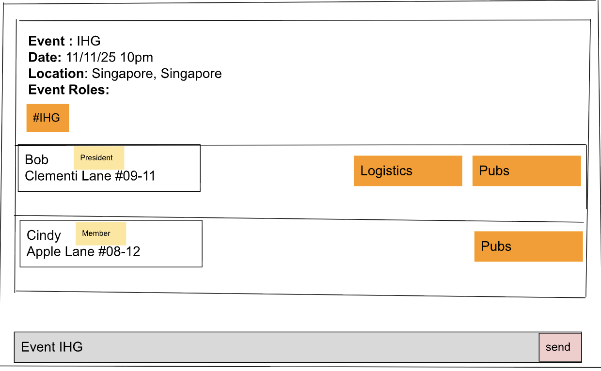

# EASync User Guide

EASync is a **desktop app for managing contacts, optimized for use via a  Line Interface** (CLI) while still having the benefits of a Graphical User Interface (GUI). If you can type fast, EASync can get your contact management tasks done faster than traditional GUI apps.

<!-- * Table of Contents -->
<page-nav-print />

--------------------------------------------------------------------------------------------------------------------

## Quick start

1. Ensure you have Java `17` or above installed in your Computer. 
   **Mac users:** Ensure you have the precise JDK version prescribed [here](https://se-education.org/guides/tutorials/javaInstallationMac.html).

1. Download the latest `.jar` file from [here](https://github.com/AY2526S1-CS2103T-T11-3/tp/releases).

1. Copy the file to the folder you want to use as the _home folder_ for your ClubBook.

1. Open a command terminal, `cd` into the folder you put the jar file in, and use the `java -jar EASync.jar` command to run the application. 
   A GUI similar to the below should appear in a few seconds. Note how the app contains some sample data. 
   

1. Type the command in the command box and press Enter to execute it. e.g. typing **`help`** and pressing Enter will open the help window. 
   Some example commands you can try:

   * `list` : Lists all contacts.

   * `add n/John Doe p/98765432 e/johnd@example.com a/John street, block 123, #01-01` : Adds a contact named `John Doe` to the Club Book.

   * `delete 3` : Deletes the 3rd contact shown in the current list.

   * `clear` : Deletes all contacts.

   * `exit` : Exits the app.

1. Refer to the [Features](#features) below for details of each command.

--------------------------------------------------------------------------------------------------------------------

## Features

<box type="info" seamless>

**Notes about the command format:** 

* Words in `UPPER_CASE` are the parameters to be supplied by the user. 
  e.g. in `add n/NAME`, `NAME` is a parameter which can be used as `add n/John Doe`.

* Items in square brackets are optional. 
  e.g `n/NAME [t/TAG]` can be used as `n/John Doe t/friend` or as `n/John Doe`.

* Items with `…`​ after them can be used multiple times including zero times. 
  e.g. `[t/TAG]…​` can be used as ` ` (i.e. 0 times), `t/friend`, `t/friend t/family` etc.

* Parameters can be in any order. 
  e.g. if the command specifies `n/NAME p/PHONE_NUMBER`, `p/PHONE_NUMBER n/NAME` is also acceptable.

* Extraneous parameters for commands that do not take in parameters (such as `help`, `list`, `exit` and `clear`) will be ignored. 
  e.g. if the command specifies `help 123`, it will be interpreted as `help`.

* If you are using a PDF version of this document, be careful when copying and pasting commands that span multiple lines as space characters surrounding line-breaks may be omitted when copied over to the application.
</box>

### Viewing help : `help`

Shows a message explaining how to access the help page.

Format: `help`

### Managing Members

### Adding a member: `addMember`

Adds a member to the club book.

Format: `add n/NAME p/PHONE_NUMBER e/EMAIL [t/TAG]…​`

<box type="tip" seamless>

**Tip:** A member can have any number of tags (including 0)
</box>

Examples:
* `add n/John Doe p/98765432 e/johnd@example.com`
* `add n/Betsy Crowe t/friend e/betsycrowe@example.com p/1234567 t/criminal`

### Listing all members : `list`

Shows a list of all members in the club book.

Format: `list`

### Editing a member : `edit`

Edits an existing member in the club book.

Format: `edit INDEX [n/NAME] [p/PHONE] [e/EMAIL] [t/TAG]…​`

* Edits the member at the specified `INDEX`. The index refers to the index number shown in the displayed member list. The index **must be a positive integer** 1, 2, 3, …​
* At least one of the optional fields must be provided.
* Existing values will be updated to the input values.
* When editing tags, the existing tags of the member will be removed i.e adding of tags is not cumulative.
* You can remove all the member’s tags by typing `t/` without
    specifying any tags after it.

Examples:
*  `edit 1 p/91234567 e/johndoe@example.com` Edits the phone number and email address of the 1st member to be `91234567` and `johndoe@example.com` respectively.
*  `edit 2 n/Betsy Crower t/` Edits the name of the 2nd member to be `Betsy Crower` and clears all existing tags.

### Locating members by name: `find`

Finds members whose names contain any of the given keywords.

Format: `find KEYWORD [MORE_KEYWORDS]`

* The search is case-insensitive. e.g `hans` will match `Hans`
* The order of the keywords does not matter. e.g. `Hans Bo` will match `Bo Hans`
* Only the name is searched.
* Only full words will be matched e.g. `Han` will not match `Hans`
* Members matching at least one keyword will be returned (i.e. `OR` search).
  e.g. `Hans Bo` will return `Hans Gruber`, `Bo Yang`

Examples:
* `find John` returns `john` and `John Doe`
* `find alex david` returns `Alex Yeoh`, `David Li` 
  

#### Deleting a member : `deleteMember`

Removes a specified member from the club book.

Format: `deleteMember INDEX`

* This will delete the member at the specified `INDEX`.
* `INDEX` refers to the index number shown in the displayed member list.
* `INDEX` **must be a positive integer 1,2,3, ...​**

Examples:
* `listMembers` then `deleteMember 2` removes the 2nd member in the displayed member list.
* `find Andy` then `deleteMember 1` removes the 1st member in the **search result**.

<box type="tip" seamless>
    You should run `listMembers` or `find` first, then look for the index of the member you want to delete. Otherwise, you might accidentally delete the wrong member.
</box>

### Managing Events

#### Deleting an event : `deleteEvent`

Removes a specified event from the club book.

Format: `deleteEvent INDEX`

* This will delete the event at the specified `INDEX`.
* `INDEX` refers to the index number shown in the displayed event list.
* `INDEX` **must be a positive integer 1,2,3, ...​**

Examples:
* `listEvents` then `deleteEvent 2` removes the 2nd event in the displayed event list.

<box type="important" seamless>
    You should run `listEvents` first, then look for the index of the event you want to delete. Otherwise, you might accidentally delete the wrong event.
</box>

### Clearing all entries : `clear`

Clears **all members and events** from the club book.

<box type="warning" seamless>

**Caution:**
This action is **irreversible**! Ensure that you truly want to clear your **entire club book** before proceeding.
</box>

Format: `clear`

### Exiting the program : `exit`

Exits the program.

Format: `exit`

### Saving the data

ClubBook data are saved in the hard disk automatically after any command that changes the data. There is no need to save manually.

### Editing the data file

ClubBook data are saved automatically as a JSON file `[JAR file location]/data/clubbook.json`. Advanced users are welcome to update data directly by editing that data file.

<box type="warning" seamless>

**Caution:**
If your changes to the data file makes its format invalid, ClubBook will discard all data and start with an empty data file at the next run.  Hence, it is recommended to take a backup of the file before editing it. 
Furthermore, certain edits can cause the ClubBook to behave in unexpected ways (e.g., if a value entered is outside the acceptable range). Therefore, edit the data file only if you are confident that you can update it correctly.
</box>

--------------------------------------------------------------------------------------------------------------------

## FAQ
**Q**: I deleted a member/event by mistake, can I undo it?  
**A**: There’s no undo feature yet, and changes save immediately. If you have a backup of members.json or events.json, restore it to recover. Otherwise, re-add the item manually. An undo command is planned for a future release, and this guide will be updated when it’s available.

**Q**: Can I delete several members/events at once?  
**A**: There’s no bulk delete feature yet. You can remove multiple items by running deleteMember or deleteEvent repeatedly. A bulk delete option is planned for a future release, and this guide will be updated when it’s available.

**Q**: How do I transfer my data to another Computer? 
**A**: Follow these steps:
  1. Make a copy of the `data` folder in the **home folder of your current installation**.  
  2. Install EASync on another computer (follow the [Quick Start guide](#quick-start))
  3. Take the copied `data` folder and overwrite the `data` folder in the **home folder of your new installation**
  4. Run EASync on the new computer and verify that your data has been transferred successfully.

--------------------------------------------------------------------------------------------------------------------

## Known issues

1. **When using multiple screens**, if you move the application to a secondary screen, and later switch to using only the primary screen, the GUI will open off-screen. The remedy is to delete the `preferences.json` file created by the application before running the application again.
2. **If you minimize the Help Window** and then run the `help` command (or use the `Help` menu, or the keyboard shortcut `F1`) again, the original Help Window will remain minimized, and no new Help Window will appear. The remedy is to manually restore the minimized Help Window.

--------------------------------------------------------------------------------------------------------------------

## Command summary

| Action           | Format, Examples                                                                                                                                                  |
|------------------|-------------------------------------------------------------------------------------------------------------------------------------------------------------------|
| **AddMember**    | `addMember n/NAME p/PHONE_NUMBER e/EMAIL [t/TAG]…​`   e.g., `add n/James Ho p/22224444 e/jamesho@example.com a/123, Clementi Rd, 1234665 t/friend t/colleague` |
| **Clear**        | `clear`                                                                                                                                                           |
| **DeleteMember** | `deleteMember INDEX`  e.g., `deleteMember 3`                                                                                                                   |
| **Edit**         | `edit INDEX [n/NAME] [p/PHONE_NUMBER] [e/EMAIL] [t/TAG]…​`  e.g.,`edit 2 n/James Lee e/jameslee@example.com`                                                   |
| **Find**         | `find KEYWORD [MORE_KEYWORDS]`  e.g., `find James Jake`                                                                                                        |
| **List**         | `list`                                                                                                                                                            |
| **DeleteEvent**  | `deleteEvent INDEX`   e.g., `deleteEvent 3`                                                                                                                    |
| **Help**         | `help`                                                                                                                                                            |
| **Exit**         | `exit`                                                                                                                                                            |
